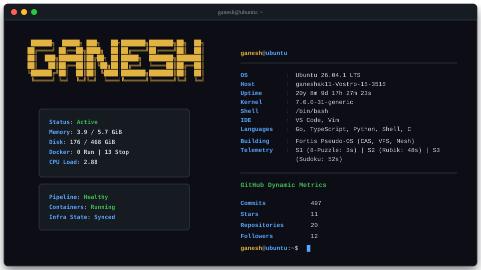
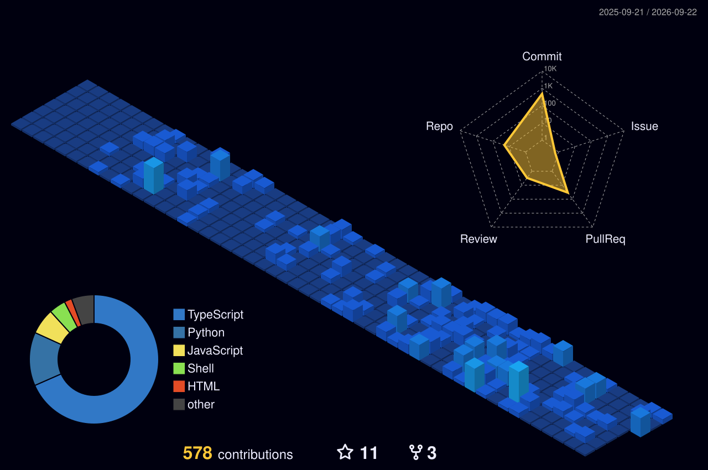

# Ganesh Angadi — DevOps & Platform Engineer

**DevOps Engineer • Backend Engineer • Platform Engineering**

I design and build reliable, observable software infrastructures. I am the creator of [Fortis-CI](https://github.com/Fortis-CI/Fortis-CI), an open-source graph-native deployment observability platform, and maintainer of the Fortis-Tools ecosystem. Passionate about AWS, Kubernetes, Terraform, and CI/CD automation.

🌐 Website
https://ganeshangadi.online

🐙 GitHub Profile
https://github.com/ganeshak11

📖 Blog
https://ganeshangadi.online/blog

---

 

---

> ### 🚧 Currently Building
>
> **Fortis Ecosystem**
>
> • 🧠 Fortis-CI → Deployment Observability Platform
>
> • 🛠️ Fortis-Tools → Open-source Developer Tooling
>
> • 📊 FortisObserve → Privacy-first Web Analytics

---

## ⚪ `$ whoami`

I enjoy building software that continues working when things go wrong. My interests lie at the intersection of **DevOps, backend engineering, observability, platform engineering, and distributed systems.**

📍 **Mysuru, Karnataka, India**

- 🚌 **System Design:** Architected a real-time city bus tracking platform with role-based access, geofencing, offline synchronization, and secure backend services.

- 🔄 **DevOps:** I enjoy designing deployment pipelines, reproducible environments, infrastructure automation, and CI/CD workflows rather than treating deployment as an afterthought.

- 🐧 **Linux:** Daily Ubuntu user comfortable with Bash, systemd, networking, permissions, containerization, and production-style debugging.

- 🛡️ **Infrastructure:** Docker-first development, container networking, AWS deployments, and infrastructure automation using modern DevOps practices.

- 📈 **Observability:** Passionate about understanding why systems fail, tracing failures across services, and designing software that is easier to operate than to debug.

---

## 🟡 `$ cat tech-stack.conf`

### ⚙️ Systems • DevOps • Cloud

### 🏗️ Backend • Databases

### 💻 Languages

### 🖥️ Frontend

---

## 🏆 Featured Projects

### 🧠 [Fortis-CI](https://github.com/Fortis-CI/Fortis-CI)

**Graph-native deployment observability platform built for modern CI/CD pipelines.**

> *Not your CI. Your CI's brain.*

- 🔍 **Graph Intelligence:** Neo4j-powered dependency graph connecting deployments, commits, services, files, and failures.
- 📊 **Observability:** Deployment history, health monitoring, rollback automation, and blast-radius analysis.
- ⚡ **Automation:** GitHub Actions integration, webhook-driven workflows, and automated deployment insights.
- 🛠️ **Stack:** TypeScript, Node.js, Express, Neo4j, Redis, Next.js, GitHub Actions.

👉 **View Repository:** https://github.com/Fortis-CI/Fortis-CI

### 🛠️ [Fortis-Tools](https://github.com/Fortis-Tools)

**Open-source developer tools focused on automation, productivity, and DevOps workflows.**

- 📦 Lightweight CLI tools published to npm.
- ⚙️ Automates repetitive development and infrastructure tasks.
- 🚀 Built to improve developer experience with simple, composable utilities.
- 🌱 Growing ecosystem of open-source tools maintained under the **Fortis-Tools** organization.

👉 **View Organization:** https://github.com/Fortis-Tools

### 🚌 [MY(suru) BUS](https://github.com/ganeshak11/MY-suru-BUS)

**Production-grade real-time public transportation platform.**

- 📍 Live GPS tracking with offline synchronization.
- 📱 Native Driver & Passenger applications built with React Native.
- 🖥️ Next.js Admin Dashboard for fleet operations.
- 🔐 Role-based access control and geofence-powered stop detection.

👉 **View Repository:** https://github.com/ganeshak11/MY-suru-BUS

### ⚡ [AUTOops](https://github.com/keerthi-180205/autoops-ai)

> *Hackathon Project*

**AI-driven cloud infrastructure provisioning platform.**

- ☁️ Designed AWS infrastructure and deployment architecture.
- 🐳 Built secure container networking for internal AI agents.
- ⚙️ Automated provisioning workflows using Docker and Node.js.

**Stack:** Docker • AWS • React • Node.js • Python

### 🔒 [Cyber Kavach](https://github.com/ganeshak11/Infra-Sentinel)

> *Hackathon Project*

**Real-time cloud threat detection and automated response platform.**

- 🛡️ Designed containerized infrastructure for security services.
- 🌐 Built isolated networking and automated deployment workflows.
- 🚨 Focused on secure service communication and production-ready deployments.

**Stack:** Docker • FastAPI • Python • Scikit-Learn • Nginx

---

## ✍️ Engineering Writing

I enjoy documenting engineering decisions, debugging sessions, system design, and the lessons hidden inside production failures. Every article is written from real projects, experiments, or mistakes that taught me something valuable.

### 🚀 DevOps & Engineering

- 📖 **How I Accidentally Blocked the Entire Internet During a Hackathon Demo**  
  🔗 *[Click to Read](https://ganeshangadi.online/blog/accidentally-blocked-the-internet)*

- 📖 **How I Won My First Hackathon**  
  🔗 *[Click to Read](https://ganeshangadi.online/blog/my-first-hackathon-win)*

### 🐧 Linux Journey

- 📖 **I Didn't Switch to Linux. I Changed My Way of Living With Computers.**  
  🔗 *[Click to Read](https://ganeshangadi.online/blog/why-linux)*

- 📖 **How I Accidentally Became a Linux User**  
  🔗 *[Click to Read](https://ganeshangadi.online/blog/how-i-became-a-linux-user)*

- 📖 **Which Linux Distro Should You Choose? From Comfort to Chaos.**  
  🔗 *[Click to Read](https://ganeshangadi.online/blog/which-linux-distro-to-choose)*

### 🏎️ Systems Thinking

- 📖 **Why Formula 1 Cars Are Just Math Equations Doing 300 km/h**  
  🔗 *[Click to Read](https://ganeshangadi.online/blog/maths-behind-F1)*

> *I believe writing is part of engineering. If you can't explain why a system works, you probably don't understand it well enough.*

---

## ⚽ `$ systemctl status speed_logic`

*If debugging was an Olympic sport, I’d take silver. Gold goes to whoever wrote the bug.*

| Challenge | Personal Best | Status |
| :--- | :--- | :--- |
| **8-Puzzle** | **3s** | ⚡ Speed Demon |
| **Rubik’s Cube** | **48s** | ⏱️ Sub-1 Minute |
| **Sudoku** | **52s** | 🧠 Logic-Driven |

---

## 🔵 `$ cat github_metrics.log`

<table align="center" width="100%" style="border-collapse: collapse; border: none;">
  <tr style="border: none;">
    <td align="center" style="border: none; padding: 5px; background: transparent;">
      
    </td>
    <td align="center" style="border: none; padding: 5px; background: transparent;">
      
    </td>
  </tr>
  <tr style="border: none;">
    <td colspan="2" align="center" style="border: none; padding: 5px; background: transparent;">
      
    </td>
  </tr>
  <tr style="border: none;">
    <td colspan="2" align="center" style="border: none; padding: 5px; background: transparent;">
      
    </td>
  </tr>
</table>

---

## 👑 `$ tail -f /var/log/focus.log`

- 🚀 **Fortis-CI:** Building an open-source graph-native deployment observability platform focused on deployment intelligence, automated rollback, and root cause analysis.

- 🛠️ **Fortis-Tools:** Growing an ecosystem of lightweight developer tools that simplify automation, productivity, and everyday DevOps workflows.

- 🏗️ **Platform Engineering:** Exploring distributed systems, Kubernetes, Terraform, cloud architecture, and production networking.

- ✍️ **Engineering Writing:** Sharing real engineering stories, debugging sessions, architectural decisions, and lessons learned while building production systems.

- 💼 **Looking For:** DevOps, Platform Engineering, Backend Engineering, and Site Reliability Engineering opportunities where reliability, automation, and system design matter.

---

> **Infrastructure isn't magic.**
>
> *It's the accumulation of thousands of engineering decisions and their trade-offs.*

 

  <!-- Replace YOUR_DISCORD_ID with your actual Discord User ID (instructions at lanyard.dev) -->
  

 

### Let's build reliable systems.

 

